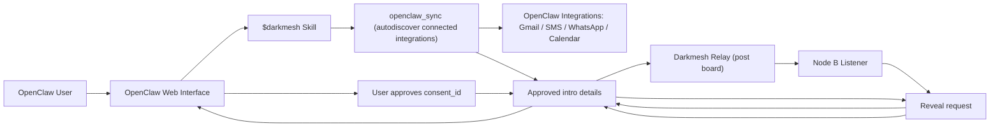

# Darkmesh

Darkmesh is a sovereign data layer for OpenClaw: it lets agents collaborate on private data signals without centralizing raw personal data.

## Why This Exists

OpenClaw already lets users connect a user's most valuable data sources (email, messaging, calendar, and more). The gap is is safe, reciprocal coordination across users.

Darkmesh is built for that gap:
- Your raw data stays local on your node.
- Nodes exchange privacy-preserving signals, not full datasets.
- Only opt-in nodes can participate.
- Sensitive reveal steps require explicit consent.

In short: it is designed to create network effects without creating a centralized data honeypot.

## Project Philosophy

- Local-first: data storage and primary computation happen on each participant's node.
- Privacy-preserving coordination: matching happens through PSI-style exchange and ranked signals.
- Reciprocal participation: nodes contribute to the network to receive value from the network.
- Consent-gated reveal: candidate discovery and identity/contact reveal are separate steps.
- Skill-native UX: operators should run it through OpenClaw prompts, not manual protocol work.

## How It Works (OpenClaw User + Behind The Scenes)



### Warm-intro lifecycle

1. User asks `$darkmesh` to ingest connected OpenClaw sources.
2. Node A derives `contacts` + `interactions` strengths locally.
3. Node A posts one warm-intro request to relay.
4. Other nodes pull request, evaluate locally, return privacy-preserving responses.
5. Node A ranks candidates and returns `consent_id` values.
6. User approves one candidate; only then does reveal happen.

## Install

```bash
git clone https://github.com/anandiyer/darkmesh.git
cd darkmesh
python3 scripts/darkmesh_setup.py
```

## Install The OpenClaw Skill

```bash
python3 /Users/ai/.codex/skills/.system/skill-installer/scripts/install-skill-from-github.py \
  --repo anandiyer/darkmesh \
  --path skills/darkmesh
```

Restart OpenClaw/Codex after skill install.

## Fastest Local Demo

Start relay + 2 nodes + listeners:

```bash
python3 scripts/darkmesh_up.py --mode demo --relay-key demo-relay-key
```

Seed sample data + run warm-intro + consent flow:

```bash
python3 scripts/darkmesh_demo.py
```

Check status:

```bash
python3 scripts/darkmesh_status.py --relay-url http://localhost:9000
```

Stop everything:

```bash
python3 scripts/darkmesh_down.py
```

## Real Operator Flow (Single Node)

Create node config:

```bash
python3 scripts/darkmesh_init.py \
  --node-id my_node \
  --self-identifiers me@domain.com \
  --relay-url http://relay-host:9000 \
  --relay-key <shared_relay_key> \
  --output config/my_node.json
```

Start node + listener:

```bash
python3 scripts/darkmesh_up.py --mode join --config config/my_node.json
```

## Load Data (Choose One Path)

### Option A: Keep CSV/JSON connector flow

```bash
python3 connectors/contacts_csv.py --url http://localhost:8001 --file /path/to/contacts.csv
python3 connectors/interactions_csv.py --url http://localhost:8001 --file /path/to/interactions.csv
```

### Option B: Auto-sync from OpenClaw-connected integrations

Set OpenClaw token once:

```bash
export OPENCLAW_TOKEN=<token>
```

Autodiscover + ingest:

```bash
python3 connectors/openclaw_sync.py \
  --url http://localhost:8001 \
  --autodiscover \
  --openclaw-base-url http://localhost:3000 \
  --self-identifier me@domain.com \
  --self-identifier +14155550123
```

Restrict to specific integrations:

```bash
python3 connectors/openclaw_sync.py \
  --url http://localhost:8001 \
  --autodiscover \
  --openclaw-base-url http://localhost:3000 \
  --include-source gmail \
  --include-source whatsapp \
  --self-identifier me@domain.com
```

Fallback if your OpenClaw events endpoint is custom:

```bash
python3 connectors/openclaw_sync.py \
  --url http://localhost:8001 \
  --events-url http://localhost:3000/api/events \
  --events-header "Authorization=Bearer <token>" \
  --self-identifier me@domain.com
```

OpenClaw export files (JSON array or NDJSON) still work:

```bash
python3 connectors/openclaw_sync.py \
  --url http://localhost:8001 \
  --events-file /path/to/openclaw_events.ndjson \
  --self-identifier me@domain.com
```

Dry run preview:

```bash
python3 connectors/openclaw_sync.py \
  --url http://localhost:8001 \
  --autodiscover \
  --openclaw-base-url http://localhost:3000 \
  --self-identifier me@domain.com \
  --dry-run
```

## Verify Integrations Are Ready

```bash
python3 scripts/darkmesh_integrations_check.py --url http://localhost:8001 --strict
```

Check node + relay status:

```bash
python3 scripts/darkmesh_status.py --config config/my_node.json
```

## Relay Host Setup

Run one relay host for your network:

```bash
python3 scripts/run_darkmesh_relay.py --host 0.0.0.0 --port 9000 --relay-key <shared_relay_key>
```

All nodes must use the same relay URL + relay key.

## Warm Intro Request + Consent Reveal

Start request:

```bash
curl -sS -X POST http://localhost:8001/darkmesh/skills/warm-intro/request \
  -H 'Content-Type: application/json' \
  -d '{
    "template": "warm_intro_v1",
    "target": {"company": "Company B", "role": "Business Development"},
    "constraints": {"max_candidates": 3, "min_strength": 0.5}
  }'
```

Approve top candidate reveal:

```bash
curl -sS -X POST http://localhost:8001/darkmesh/skills/warm-intro/consent \
  -H 'Content-Type: application/json' \
  -d '{
    "request_id": "<request_id>",
    "consent_id": "<consent_id>"
  }'
```

## Example OpenClaw Prompt

```text
Use $darkmesh to autodiscover all OpenClaw-connected integrations, ingest them into node http://localhost:8001, use OPENCLAW_TOKEN from env, run dry-run first, then run real ingest.
```

## Main Scripts

- `scripts/darkmesh_setup.py`: install dependencies
- `scripts/darkmesh_up.py`: start relay/nodes/listeners
- `scripts/darkmesh_down.py`: stop services
- `scripts/darkmesh_status.py`: health + readiness summary
- `scripts/darkmesh_init.py`: create node config
- `scripts/darkmesh_integrations_check.py`: verify required integrations
- `scripts/darkmesh_demo.py`: run sample seed + warm-intro query
- `scripts/darkmesh_listener.py`: listener loop
- `scripts/run_darkmesh_relay.py`: relay host
- `scripts/run_darkmesh.py`: node API host

## Main Connectors

- `connectors/contacts_csv.py`: ingest contacts from CSV
- `connectors/interactions_csv.py`: ingest interactions from CSV
- `connectors/openclaw_sync.py`: derive contacts/interactions from OpenClaw sources (autodiscovery, API URL, or file)

## Current Limitations

- Prototype quality (not production hardened)
- OpenClaw API autodiscovery uses common endpoint conventions; override paths if your deployment differs
- No TLS by default
- Add stronger auth and key management before internet deployment
