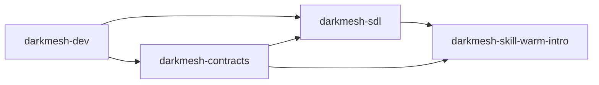
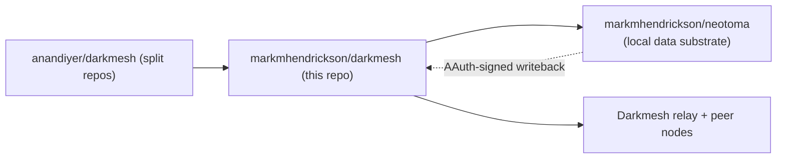

# Darkmesh

Darkmesh is a sovereign data layer for agent collaboration.

It is designed to let nodes coordinate on private data signals without centralizing raw personal data.

> **About this fork.** This repository
> ([markmhendrickson/darkmesh](https://github.com/markmhendrickson/darkmesh))
> is a fork of [anandiyer/darkmesh](https://github.com/anandiyer/darkmesh)
> that keeps the full runtime here and adds a
> [Neotoma](https://github.com/markmhendrickson/neotoma) integration as
> Darkmesh's local data substrate. See
> [docs/neotoma_integration.md](docs/neotoma_integration.md) for the
> full write-up. Upstream links below continue to point at the
> canonical split repos.
>
> Running without Neotoma configured behaves exactly like upstream — the
> integration is additive and enabled by config.

## Primer

Darkmesh exists to solve a specific gap:
- Users and agents already have rich private context (email, messages, CRM, calendar, etc.).
- Most networks only work if that context is uploaded to a central platform.
- Centralization creates a honeypot and weakens user control.

Darkmesh takes a different path:
- Local-first data: raw data stays on each operator's node.
- Privacy-preserving coordination: nodes exchange constrained signals, not full datasets.
- Reciprocal participation: opt-in nodes can query and answer on shared protocols.
- Consent-gated reveal: discovery and identity reveal are separate steps.

A canonical example is warm intros:
- Node A asks, "who can help me reach X?"
- peers evaluate locally and respond privately
- reveal is only unlocked after explicit consent

## Neotoma integration (this fork)

This fork treats [Neotoma](https://github.com/markmhendrickson/neotoma)
— a local-first, event-sourced entity graph with cryptographic
attribution — as Darkmesh's data substrate. The integration lands in
three progressive, independently-enableable phases:

| Phase | What lands                                         | Entry point                                                                 |
|-------|----------------------------------------------------|-----------------------------------------------------------------------------|
| 0     | Sync connector: Neotoma entities → Darkmesh ingest | [`connectors/neotoma_sync.py`](connectors/neotoma_sync.py)                  |
| 1     | Live contact store: query Neotoma at request time  | [`darkmesh/neotoma_client.py`](darkmesh/neotoma_client.py), `ContactStore` in [`darkmesh/service.py`](darkmesh/service.py) |
| 2     | AAuth writeback: sign `warm_intro_reveal` events   | [`darkmesh/aauth_signer.py`](darkmesh/aauth_signer.py), `NeotomaWriteback` in [`darkmesh/service.py`](darkmesh/service.py) |

### Problems this fork solves

Running Darkmesh on top of the upstream `EncryptedVault` works well for
a single-source, batch-loaded deployment. It breaks down in the
scenarios below — each one is a first-class pain point this fork
addresses.

| Problem (upstream)                                                                                     | Why it hurts                                                                                                               | Solution in this fork                                                                                                                         |
|--------------------------------------------------------------------------------------------------------|----------------------------------------------------------------------------------------------------------------------------|-----------------------------------------------------------------------------------------------------------------------------------------------|
| Vault contents drift from reality the moment a connector finishes                                      | Warm-intro relevance decays as contacts, roles, and interactions evolve; re-syncing is a manual chore per source           | Phase 1 `ContactStore` reads Neotoma's live entity graph on each request, with a short TTL cache — no re-sync step                            |
| Strength scores produced by different connectors (CSV, OpenClaw, email) use different scales           | Mixing sources in one vault makes strength untrustworthy; a "0.9" from one path isn't comparable to a "0.9" from another   | `contact_live_strength()` mirrors the connector heuristic (volume + relationships + recency, same weights) so scores are unified by construction |
| Warm-intro reveals leave no durable, tamper-evident record                                             | Operators can't audit what was revealed, to whom, by which node, under which consent — discovery side effects are ephemeral | Phase 2 writes `warm_intro_reveal` entities with full consent context, signed via RFC 9421 HTTP Message Signatures (`aa-agent+jwt`)           |
| Agent-to-agent writes to a shared data layer have no authorization model                               | Any agent with network access can overwrite another's data; there's no way to scope OpenClaw to one type and Darkmesh to another | Neotoma's capability registry ([`config/neotoma_agent_capabilities.json`](config/neotoma_agent_capabilities.json)) enforces per-agent, per-op, per-entity-type ACLs |
| Running against a local Neotoma over `http://` hit a Neotoma signature-base mismatch                   | Signature verification failed under local dev because the verifier hardcoded `https://` when recomputing `@target-uri`     | Signer covers `@path` instead of `@target-uri` — scheme-agnostic and aligned with hellocoop's `DEFAULT_COMPONENTS_BODY`                       |
| Neotoma's reducer crashed (500) when the first observation of an entity had a `null` field             | Writeback succeeded but the entity ended up with `NO SNAPSHOT`, making the event invisible to queries                      | `_build_entity` drops null-valued fields pre-send; a defensive guard also landed upstream in `ObservationReducer.lastWriteWins`               |
| Contact data is duplicated between Darkmesh's vault and the operator's other tools ingesting Neotoma   | Every Darkmesh sync is a fresh copy of data Neotoma already has, doubling storage and divergence risk                      | Phase 1 removes the copy — Darkmesh reads the same live entity graph other agents write to                                                    |

### Use cases unique to this fork

1. **Live-graph warm intros.** Ask for a warm intro against the entity
   graph your *other* agents (mail ingesters, CRM sync, calendar
   plugins) are continuously updating — no "did I re-sync today?"
   disclaimer. Run
   [`connectors/neotoma_sync.py --dry-run`](connectors/neotoma_sync.py)
   any time to see exactly what the node currently considers reachable.

2. **Provenance-audited agent network.** Every reveal lands in Neotoma
   with `attribution_tier`, `agent_sub`, `agent_iss`, and
   `agent_thumbprint`. Query the Neotoma Inspector (`GET /entities?entity_type=warm_intro_reveal`)
   and filter by agent to answer questions like "show every reveal my
   `mark_local` node made last week, and prove each was signed by this
   ES256 key."

3. **Capability-scoped agent-to-agent coordination.** Multiple agents
   (`darkmesh-node@mark_local`, `openclaw-agent@anand`, …) share one
   Neotoma database but see different write surfaces. OpenClaw can
   write `writer_activity`; Darkmesh reads it to tier the author; OpenClaw
   cannot write `warm_intro_reveal`. Denial messages are explicit
   (`Agent "openclaw@anand" is not permitted to store_structured
   entity_type "warm_intro_reveal"`).

4. **Ghostwriting pipeline state, privately.** Downstream agents
   classify a writer (`tier=expert` in `ai-content`) from aggregated
   `writer_activity` counts and engagement — no post bodies cross the
   boundary, and the decision is traceable to exact observations.

5. **Asymmetric-richness diagnostics.** Running the same identity
   through the vault path and the live path surfaces which source has
   the fresher fields. In testing, Casey Connector came out with
   `strength=0.85` from a vault seed vs. `0.40` live — a signal that
   the live graph was missing `org` / `role` and should be enriched.

6. **Fleet operators.** A single operator running several Darkmesh
   nodes (each with its own ES256 keypair and `darkmesh-node@<tag>`
   sub) gets per-node provenance on every reveal, with aggregate
   queries ("what did any of my nodes reveal about Company X this
   quarter?") falling out of ordinary entity queries.

See [docs/neotoma_integration.md](docs/neotoma_integration.md) for:
- Architecture diagram per phase
- Contact / strength mapping between the two systems
- Config fields to add to your node (`neotoma_url`, `neotoma_token`, …)
- AAuth key provisioning, `Signature-Key` format, and capability
  registration
- Full joint-test results
- Troubleshooting notes (reducer null-field crash, `@target-uri` vs
  `@path`, RFC 8941 `Signature-Key` format)

### Minimal enablement

```bash
# Phase 2 — provision an ES256 keypair for AAuth writeback
python -m darkmesh.aauth_signer keygen \
  --private-out secrets/mark_local_darkmesh_private.jwk \
  --public-out  secrets/mark_local_darkmesh_public.jwk

# Set env (private JWK path, agent sub, agent iss)
source scripts/aauth_env.sh mark_local

# Phase 1 — add to your node config
#   "neotoma_url": "http://localhost:3080",
#   "neotoma_entity_type": "contact",
#   "neotoma_cache_ttl_seconds": 15.0

# Start the node
python3 scripts/darkmesh_up.py --mode join --config config/mark_local.json
```

Without `neotoma_url` the node keeps using its `EncryptedVault`. Without
the AAuth env vars, the node still serves warm intros but skips the
Neotoma writeback.

## Upstream split repositories

`anandiyer/darkmesh` upstream is a **meta repository** and project
primer pointing at split implementation repos. Those remain the
reference implementations if you do not need the Neotoma integration:

- [darkmesh-sdl](https://github.com/anandiyer/darkmesh-sdl): sovereign data layer core runtime (node, relay, vault, plugin host)
- [darkmesh-skill-warm-intro](https://github.com/anandiyer/darkmesh-skill-warm-intro): warm-intro skill/plugin built on SDL
- [darkmesh-dev](https://github.com/anandiyer/darkmesh-dev): `darkmesh.dev` website and admin dashboard
- [darkmesh-contracts](https://github.com/anandiyer/darkmesh-contracts): shared JSON schemas/contracts

### How the upstream split fits together



### How this fork fits in



## Where to start

1. Local demo in 9 commands: [QUICKSTART.md](QUICKSTART.md)
2. Neotoma integration details: [docs/neotoma_integration.md](docs/neotoma_integration.md)
3. Runtime and network setup (upstream): [darkmesh-sdl](https://github.com/anandiyer/darkmesh-sdl)
4. Warm intro behavior and listener (upstream): [darkmesh-skill-warm-intro](https://github.com/anandiyer/darkmesh-skill-warm-intro)
5. Public/admin web experience (upstream): [darkmesh-dev](https://github.com/anandiyer/darkmesh-dev)
6. API/schema references (upstream): [darkmesh-contracts](https://github.com/anandiyer/darkmesh-contracts)

## Status of this repo

This fork is maintained as:
- a full-runtime workspace for the Neotoma integration
- a staging ground for AAuth-signed agent-to-agent writebacks
- a compatibility-preserving companion to upstream Darkmesh

Upstream `anandiyer/darkmesh` remains the canonical ecosystem entry
point and architectural primer. Core protocol development happens in
the four upstream repos above.
