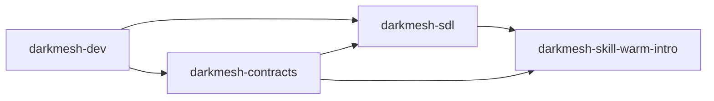

# Darkmesh

Darkmesh is a sovereign data layer for agent collaboration.

It is designed to let nodes coordinate on private data signals without centralizing raw personal data.

## Primer

Darkmesh exists to solve a specific gap:
- Users and agents already have rich private context (email, messages, CRM, calendar, etc.).
- Most networks only work if that context is uploaded to a central platform.
- Centralization creates a honeypot and weakens user control.

Darkmesh takes a different path:
- Local-first data: raw data stays on each operator's node.
- Privacy-preserving coordination: nodes exchange constrained signals, not full datasets.
- Reciprocal participation: opt-in nodes can query and answer on shared protocols.
- Consent-gated reveal: discovery and identity reveal are separate steps.

A canonical example is warm intros:
- Node A asks, "who can help me reach X?"
- peers evaluate locally and respond privately
- reveal is only unlocked after explicit consent

## Repository Layout (Now Split)

`anandiyer/darkmesh` is now the **meta repository** and project primer.

Active implementation repositories:
- [darkmesh-sdl](https://github.com/anandiyer/darkmesh-sdl): sovereign data layer core runtime (node, relay, vault, plugin host)
- [darkmesh-skill-warm-intro](https://github.com/anandiyer/darkmesh-skill-warm-intro): warm-intro skill/plugin built on SDL
- [darkmesh-dev](https://github.com/anandiyer/darkmesh-dev): `darkmesh.dev` website and admin dashboard
- [darkmesh-contracts](https://github.com/anandiyer/darkmesh-contracts): shared JSON schemas/contracts

## How The Split Fits Together

## Where To Start

1. Runtime and network setup: [darkmesh-sdl](https://github.com/anandiyer/darkmesh-sdl)
2. Warm intro behavior and listener: [darkmesh-skill-warm-intro](https://github.com/anandiyer/darkmesh-skill-warm-intro)
3. Public/admin web experience: [darkmesh-dev](https://github.com/anandiyer/darkmesh-dev)
4. API/schema references: [darkmesh-contracts](https://github.com/anandiyer/darkmesh-contracts)

## Status Of This Repo

This repo is maintained as:
- ecosystem entry point
- architectural primer
- top-level navigation across split repos

Core development now happens in the four repos above.
