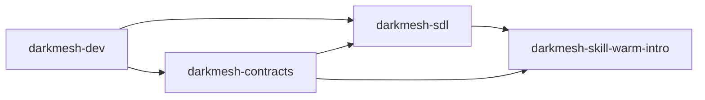
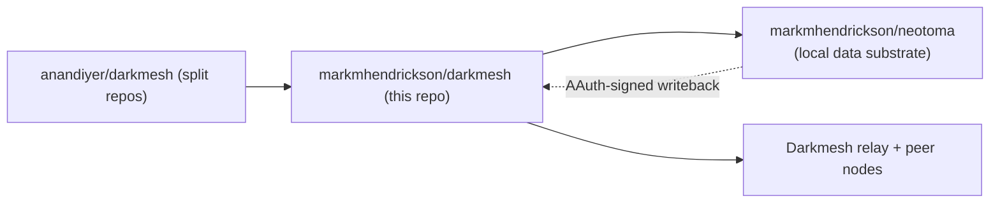

# Darkmesh

Darkmesh is a sovereign data layer for agent collaboration.

It is designed to let nodes coordinate on private data signals without centralizing raw personal data.

> **About this fork.** This repository
> ([markmhendrickson/darkmesh](https://github.com/markmhendrickson/darkmesh))
> is a fork of [anandiyer/darkmesh](https://github.com/anandiyer/darkmesh)
> that keeps the full runtime here and adds a
> [Neotoma](https://github.com/markmhendrickson/neotoma) integration as
> Darkmesh's local data substrate. See
> [docs/neotoma_integration.md](docs/neotoma_integration.md) for the
> full write-up. Upstream links below continue to point at the
> canonical split repos.
>
> Running without Neotoma configured behaves exactly like upstream — the
> integration is additive and enabled by config.

## Primer

Darkmesh exists to solve a specific gap:
- Users and agents already have rich private context (email, messages, CRM, calendar, etc.).
- Most networks only work if that context is uploaded to a central platform.
- Centralization creates a honeypot and weakens user control.

Darkmesh takes a different path:
- Local-first data: raw data stays on each operator's node.
- Privacy-preserving coordination: nodes exchange constrained signals, not full datasets.
- Reciprocal participation: opt-in nodes can query and answer on shared protocols.
- Consent-gated reveal: discovery and identity reveal are separate steps.

A canonical example is warm intros:
- Node A asks, "who can help me reach X?"
- peers evaluate locally and respond privately
- reveal is only unlocked after explicit consent

## Neotoma integration (this fork)

This fork treats Neotoma as Darkmesh's local data substrate and lands in
three progressive phases:

| Phase | What lands                                         | Entry point                                                                 |
|-------|----------------------------------------------------|-----------------------------------------------------------------------------|
| 0     | Sync connector: Neotoma entities → Darkmesh ingest | [`connectors/neotoma_sync.py`](connectors/neotoma_sync.py)                  |
| 1     | Live contact store: query Neotoma at request time  | [`darkmesh/neotoma_client.py`](darkmesh/neotoma_client.py), `ContactStore` in [`darkmesh/service.py`](darkmesh/service.py) |
| 2     | AAuth writeback: sign `warm_intro_reveal` events   | [`darkmesh/aauth_signer.py`](darkmesh/aauth_signer.py), `NeotomaWriteback` in [`darkmesh/service.py`](darkmesh/service.py) |

Each phase is optional and config-gated. See
[docs/neotoma_integration.md](docs/neotoma_integration.md) for:

- Architecture diagram per phase
- Contact / strength mapping between the two systems
- Config fields to add to your node (`neotoma_url`, `neotoma_token`, …)
- AAuth key provisioning, `Signature-Key` format, and capability
  registration
- Joint-test results across vault vs live, cross-node warm intros,
  capability-scoped agent-to-agent queries, reveal provenance audit,
  and ghostwriting pipeline coordination
- Troubleshooting notes (reducer null-field crash, `@target-uri` vs
  `@path`, RFC 8941 `Signature-Key` format)

### Minimal enablement

```bash
# Phase 2 — provision an ES256 keypair for AAuth writeback
python -m darkmesh.aauth_signer keygen \
  --private-out secrets/mark_local_darkmesh_private.jwk \
  --public-out  secrets/mark_local_darkmesh_public.jwk

# Set env (private JWK path, agent sub, agent iss)
source scripts/aauth_env.sh mark_local

# Phase 1 — add to your node config
#   "neotoma_url": "http://localhost:3080",
#   "neotoma_entity_type": "contact",
#   "neotoma_cache_ttl_seconds": 15.0

# Start the node
python3 scripts/darkmesh_up.py --mode join --config config/mark_local.json
```

Without `neotoma_url` the node keeps using its `EncryptedVault`. Without
the AAuth env vars, the node still serves warm intros but skips the
Neotoma writeback.

## Upstream split repositories

`anandiyer/darkmesh` upstream is a **meta repository** and project
primer pointing at split implementation repos. Those remain the
reference implementations if you do not need the Neotoma integration:

- [darkmesh-sdl](https://github.com/anandiyer/darkmesh-sdl): sovereign data layer core runtime (node, relay, vault, plugin host)
- [darkmesh-skill-warm-intro](https://github.com/anandiyer/darkmesh-skill-warm-intro): warm-intro skill/plugin built on SDL
- [darkmesh-dev](https://github.com/anandiyer/darkmesh-dev): `darkmesh.dev` website and admin dashboard
- [darkmesh-contracts](https://github.com/anandiyer/darkmesh-contracts): shared JSON schemas/contracts

### How the upstream split fits together



### How this fork fits in



## Where to start

1. Local demo in 9 commands: [QUICKSTART.md](QUICKSTART.md)
2. Neotoma integration details: [docs/neotoma_integration.md](docs/neotoma_integration.md)
3. Runtime and network setup (upstream): [darkmesh-sdl](https://github.com/anandiyer/darkmesh-sdl)
4. Warm intro behavior and listener (upstream): [darkmesh-skill-warm-intro](https://github.com/anandiyer/darkmesh-skill-warm-intro)
5. Public/admin web experience (upstream): [darkmesh-dev](https://github.com/anandiyer/darkmesh-dev)
6. API/schema references (upstream): [darkmesh-contracts](https://github.com/anandiyer/darkmesh-contracts)

## Status of this repo

This fork is maintained as:
- a full-runtime workspace for the Neotoma integration
- a staging ground for AAuth-signed agent-to-agent writebacks
- a compatibility-preserving companion to upstream Darkmesh

Upstream `anandiyer/darkmesh` remains the canonical ecosystem entry
point and architectural primer. Core protocol development happens in
the four upstream repos above.
