# Darkmesh ↔ Neotoma Integration

This document describes how this Darkmesh fork
([markmhendrickson/darkmesh](https://github.com/markmhendrickson/darkmesh))
consumes [Neotoma](https://github.com/markmhendrickson/neotoma) as its local
data substrate. Three phases land progressively:

1. **Phase 0 — Sync connector.** Pull contacts from Neotoma's entity graph
   into Darkmesh's encrypted vault.
2. **Phase 1 — Live vault.** Skip the vault entirely and serve contact
   queries from Neotoma at request time.
3. **Phase 2 — AAuth writeback.** Record warm-intro reveals back to Neotoma
   with an RFC 9421 HTTP Message Signature so every event is
   cryptographically attributed to the originating Darkmesh node.

Upstream Darkmesh is unchanged in shape: this fork only adds code paths
that light up when the right config / env vars are present. Running
without a `neotoma_url` falls through to the existing `EncryptedVault`
and keeps the warm-intro protocol bit-for-bit compatible.

## Architecture

```mermaid
flowchart TD
  subgraph phase0 [Phase 0: Sync connector]
    NeotomaAPI0["Neotoma HTTP API"] -->|"POST /entities/query"| Connector["connectors/neotoma_sync.py"]
    Connector -->|"POST /darkmesh/ingest"| Vault0["Darkmesh vault (encrypted)"]
  end

  subgraph phase1 [Phase 1: Live vault]
    NeotomaAPI1["Neotoma HTTP API"] -->|"POST /entities/query"| ContactStore["darkmesh/service.py ContactStore"]
    ContactStore -->|"with TTL cache"| WarmIntro["warm-intro evaluator"]
  end

  subgraph phase2 [Phase 2: AAuth writeback]
    Reveal["warm_intro_reveal"] -->|"AAuth-signed POST /store"| NeotomaAPI2["Neotoma"]
    NeotomaAPI2 --> Provenance["attribution_tier: hardware\nagent_sub: darkmesh-node@..."]
  end
```



## Phase 0: Sync connector

`connectors/neotoma_sync.py` is a standalone CLI following the existing
`openclaw_sync.py` pattern. It reads entities from Neotoma, maps them to
Darkmesh's ingest shape, computes a strength score from provenance
signals, and ingests into the node.

### Data mapping

| Neotoma snapshot field        | Darkmesh contact field |
|-------------------------------|------------------------|
| `canonical_name` / `name`     | `name`                 |
| `email` / `primary_email`     | `email`                |
| `company` / `organization`    | `org`                  |
| `role` / `title`              | `role`                 |
| (computed)                    | `strength`             |
| `entity_id`                   | `neotoma_entity_id`    |

### Strength heuristic

Strength is a weighted blend of volume, relationships, and recency:

```
volume        = 1 - exp(-observation_count / 8)
relationships = 1 - exp(-relationship_count / 6)
recency       = exp(-age_days / 45)

strength = 0.45 * volume + 0.20 * relationships + 0.35 * recency
```

Clamped to `[0, 1]`. Mirrors `openclaw_sync.compute_strength()` so
strength distributions are comparable across source channels.

### Usage

```bash
# Dry run (no writes), prints mapped top contacts + summary
python connectors/neotoma_sync.py \
  --url http://localhost:8001 \
  --neotoma-url http://localhost:3080 \
  --self-identifier you@example.com \
  --node-key $DARKMESH_NODE_KEY \
  --dry-run

# Real ingest
python connectors/neotoma_sync.py \
  --url http://localhost:8001 \
  --neotoma-url http://localhost:3080 \
  --self-identifier you@example.com \
  --node-key $DARKMESH_NODE_KEY
```

Flags: `--neotoma-url`, `--neotoma-token` (or `NEOTOMA_TOKEN`),
`--entity-type contact`, `--min-strength`, `--max-contacts`,
`--self-identifier` (repeatable), `--dry-run`.

## Phase 1: Live Neotoma-backed contacts

`darkmesh/neotoma_client.py` is a thin HTTP client exposing
`query_entities()` and `get_relationships()`. The service layer wraps
both `EncryptedVault` and `NeotomaClient` in a `ContactStore`
abstraction:

```python
class ContactStore:
    def load(self, dataset: str) -> list[dict]:
        if self.live and dataset in {"contacts", "interactions"}:
            return self._live(dataset)  # Neotoma
        return self._vault.load(dataset)  # existing vault
```

A short in-process TTL cache (`neotoma_cache_ttl_seconds`, default 15s)
keeps one warm-intro request from hitting Neotoma three times. On any
request error, the loader logs and falls back to the vault.

### Config

Add these fields to your node config (e.g. `config/mark_local.json`):

```json
{
  "neotoma_url": "http://localhost:3080",
  "neotoma_token": "",
  "neotoma_entity_type": "contact",
  "neotoma_max_entities": 2000,
  "neotoma_cache_ttl_seconds": 15.0
}
```

Omitting `neotoma_url` disables the live path entirely — the node
behaves as it did pre-integration.

### Strength in live mode

Strength is computed on the fly from the same inputs as Phase 0
(`contact_live_strength()`), so a contact's score matches whether you
went through the sync connector or hit the live graph.

### Phase 0 vs Phase 1 in practice

Both paths are operational. A concrete comparison from the joint tests,
loading the same identity (`casey@connector.com`) on the same node:

| Path      | `name`            | `org`            | `role`  | `strength` |
|-----------|-------------------|------------------|---------|------------|
| Vault     | Casey Connector   | Connector LLC    | Advisor | 0.85       |
| Neotoma   | Casey Connector   | (empty)          | (empty) | 0.40       |

The gap is data density, not a bug in the loader: the Neotoma seed for
this fixture only carries `name` and `email`, so `org`/`role` land empty
and the recency/volume signal dominates the score. In real deployments
the live path tracks the current entity graph rather than a stale
snapshot, which is the point.

## Phase 2: AAuth-signed writeback

`darkmesh/aauth_signer.py` is the Python counterpart of Neotoma's
`services/agent-site/netlify/lib/aauth_signer.ts` and
`src/cli/aauth_signer.ts`. It produces RFC 9421 HTTP Message Signatures
with the AAuth profile: an `aa-agent+jwt` agent token carried in the
`Signature-Key` header. Neotoma's `src/middleware/aauth_verify` verifies
the signature and stamps provenance with `attribution_tier: hardware`
(ES256/EdDSA) or `software`.

### Key provisioning

```bash
python -m darkmesh.aauth_signer keygen \
  --private-out secrets/mark_local_darkmesh_private.jwk \
  --public-out  secrets/mark_local_darkmesh_public.jwk
```

Both `secrets/*.jwk` and `secrets/*_private*` are in `.gitignore`.

### Env setup

```bash
# Sources all three env vars below
source scripts/aauth_env.sh mark_local
```

Equivalent manual setup:

```bash
export DARKMESH_AAUTH_PRIVATE_JWK_PATH=/abs/path/to/private.jwk
export DARKMESH_AAUTH_SUB="darkmesh-node@mark_local"
export DARKMESH_AAUTH_ISS="https://darkmesh.local"
```

### What gets written

On a successful warm-intro reveal, the node writes an entity like:

```json
{
  "entity_type": "warm_intro_reveal",
  "canonical_name": "Warm intro d40422bb -> Taylor BD",
  "request_id": "d40422bb",
  "consent_id": "89e0a8050c",
  "requester_node_id": "mark_local",
  "responder_node_id": "node_b",
  "darkmesh_node_id": "mark_local",
  "side": "requester",
  "template": "warm_intro_v1",
  "approved": true,
  "relationship_strength": 0.88,
  "target_org": "Company X",
  "target_role": "Business Development",
  "target_contact_name": "Taylor BD",
  "revealed_at": "2026-04-23T05:38:16.549485+00:00",
  "data_source": "darkmesh-node:mark_local"
}
```

Null-valued fields are stripped from the payload before sending so
Neotoma's reducer never has to snapshot an entity whose only value for
a field is `null` (that path previously crashed; see Troubleshooting
below).

The observation carries the full AAuth provenance:

```
attribution_tier:   hardware
agent_sub:          darkmesh-node@mark_local
agent_iss:          https://darkmesh.local
agent_algorithm:    ES256
agent_thumbprint:   zfWTU...
```

Writeback is best-effort: transport or verification failures are logged
but never propagated to the warm-intro caller.

### Covered HTTP signature components

The signer covers `@method`, `@authority`, `@path`, `content-type`,
`content-digest`, and `signature-key`. `@path` is used instead of
`@target-uri` because Neotoma's verifier (via `@hellocoop/httpsig`)
recomputes `@target-uri` with a hardcoded `https://` prefix, which would
mismatch when running locally over `http://`. `@path` is scheme-agnostic
and aligns with hellocoop's `DEFAULT_COMPONENTS_BODY` profile.

### Capability registry

`config/neotoma_agent_capabilities.json` registers this node with
Neotoma:

```json
{
  "default_deny": false,
  "agents": {
    "darkmesh-node@mark_local": {
      "match": {
        "sub": "darkmesh-node@mark_local",
        "iss": "https://darkmesh.local"
      },
      "capabilities": [
        { "op": "store_structured",     "entity_types": ["warm_intro_reveal", "warm_intro_request", "network_signal"] },
        { "op": "create_relationship",  "entity_types": ["warm_intro_reveal", "contact"] },
        { "op": "retrieve",             "entity_types": ["contact", "warm_intro_reveal"] }
      ]
    }
  }
}
```

Point Neotoma at this file via
`NEOTOMA_AGENT_CAPABILITIES_FILE=<abs-path>` and enable enforcement with
`NEOTOMA_AGENT_CAPABILITIES_ENFORCE=true`. Any op outside the declared
scope is rejected by Neotoma before it touches the DB.

## Joint tests

These were run end-to-end against a local Darkmesh relay plus
`mark_local` (Neotoma-backed, AAuth writeback on) and `node_b` (vault-
backed). All five passed.

| # | Test                                    | Outcome |
|---|-----------------------------------------|---------|
| 1 | Cross-node warm intro                   | Warm intro for "Taylor BD @ Company X" completed end-to-end. Reveal landed in Neotoma as `warm_intro_reveal` entity with snapshot + `attribution_tier: hardware`. |
| 2 | Asymmetric data richness (vault vs live) | Same contact produced `strength=0.85` via vault, `0.40` via live Neotoma — divergence tracks data density in each path, as expected. |
| 3 | Agent-to-agent query w/ capability scoping | A second simulated agent (`openclaw-agent@anand`) was blocked from writing `warm_intro_reveal` while `mark_local` was allowed. Exact denial message: `Agent "openclaw@anand" is not permitted to store_structured entity_type "warm_intro_reveal"`. |
| 4 | Reveal provenance audit                 | Full trust chain observable in Neotoma: ES256 → `attribution_tier: hardware`, `agent_sub: darkmesh-node@mark_local`, `agent_iss: https://darkmesh.local`, `agent_thumbprint: zfWTU…`. |
| 5 | Ghostwriting pipeline state coordination | Anand-simulated OpenClaw wrote `writer_activity` entities; Darkmesh classified him as `tier=expert` in `ai-content` purely from aggregated counts/engagement — no post content crossed the boundary. |

## Troubleshooting

### `500 Cannot read properties of undefined (reading 'fields')`

**Symptom:** Writeback returns HTTP 500 from `POST /store` and the
entity ends up with `NO SNAPSHOT` in Neotoma's `entity_snapshots` table.

**Root cause:** Neotoma's `computeSnapshotWithDefaults` used
`lastWriteWins(field, observations.filter(fields[field] != null))`,
which returns an empty array when the only observation has `null` for
that field. `observations[0].fields` then throws.

**Fixes applied:**

1. In this fork, `service.NeotomaWriteback._build_entity` strips
   null-valued fields from the payload before signing.
2. Upstream Neotoma's `lastWriteWins` now returns a sentinel
   `{ value: undefined, source_observation_id: "" }` for empty inputs
   and the caller drops it from the snapshot. (See upstream commit
   landing the reducer guard.)

### `Unsupported jkt-jwt typ: aa-agent+jwt`

Use the `jwt` scheme in `Signature-Key`, not `jkt-jwt`. The full token
must carry `cnf.jwk`. Both are already handled correctly by
`aauth_signer.py`; this only bites if you hand-roll signatures.

### `Signature verification failed: unknown`

Almost always one of:

- Mismatched `@target-uri` vs `@path` (upstream verifier hardcodes
  `https://`). This fork uses `@path`.
- `Signature-Key` header not in RFC 8941 Dictionary format
  (`aasig=jwt;jwt="<token>"`).
- JWT missing `cnf.jwk` claim.

### `observation_source` column missing

If you're running against a Neotoma database initialized before the
`observation_source` column was added, apply:

```bash
sqlite3 /path/to/neotoma.db "ALTER TABLE observations ADD COLUMN observation_source TEXT;"
```

## File map

| File                                           | Phase | Purpose                                          |
|------------------------------------------------|-------|--------------------------------------------------|
| `connectors/neotoma_sync.py`                   | 0     | Standalone sync CLI: Neotoma → Darkmesh ingest   |
| `darkmesh/neotoma_client.py`                   | 1     | Read-only HTTP client + contact mapper           |
| `darkmesh/service.py::ContactStore`            | 1     | Vault-vs-live selection + TTL cache              |
| `config/mark_local.json`                       | 1     | Sample live-mode node config                     |
| `config/node_b_local.json`                     | —     | Sample vault-mode counterpart node config        |
| `darkmesh/aauth_signer.py`                     | 2     | Python AAuth signer (RFC 9421 + `aa-agent+jwt`)  |
| `darkmesh/service.py::NeotomaWriteback`        | 2     | Signed writeback of `warm_intro_reveal` events   |
| `config/neotoma_agent_capabilities.json`       | 2     | Neotoma-side capability grant for this node      |
| `scripts/aauth_env.sh`                         | 2     | Shell helper to export required AAuth env vars   |

## Upstream compatibility

This fork is designed to be a drop-in replacement for
`anandiyer/darkmesh` with additive functionality. The warm-intro
protocol wire format, PSI handshake, consent flow, and relay contract
are unchanged. Nodes running this fork can warm-intro with nodes
running the upstream; only the storage substrate and the post-reveal
writeback differ.
