# Darkmesh ↔ Neotoma Integration

This document describes how this Darkmesh fork
([markmhendrickson/darkmesh](https://github.com/markmhendrickson/darkmesh))
consumes [Neotoma](https://github.com/markmhendrickson/neotoma) as its local
data substrate. Three phases land progressively:

1. **Phase 0 — Sync connector.** Pull contacts from Neotoma's entity graph
   into Darkmesh's encrypted vault.
2. **Phase 1 — Live vault.** Skip the vault entirely and serve contact
   queries from Neotoma at request time.
3. **Phase 2 — AAuth writeback.** Record warm-intro reveals back to Neotoma
   with an RFC 9421 HTTP Message Signature so every event is
   cryptographically attributed to the originating Darkmesh node.

Upstream Darkmesh is unchanged in shape: this fork only adds code paths
that light up when the right config / env vars are present. Running
without a `neotoma_url` falls through to the existing `EncryptedVault`
and keeps the warm-intro protocol bit-for-bit compatible.

## Architecture

```mermaid
flowchart TD
  subgraph phase0 [Phase 0: Sync connector]
    NeotomaAPI0["Neotoma HTTP API"] -->|"POST /entities/query"| Connector["connectors/neotoma_sync.py"]
    Connector -->|"POST /darkmesh/ingest"| Vault0["Darkmesh vault (encrypted)"]
  end

  subgraph phase1 [Phase 1: Live vault]
    NeotomaAPI1["Neotoma HTTP API"] -->|"POST /entities/query"| ContactStore["darkmesh/service.py ContactStore"]
    ContactStore -->|"with TTL cache"| WarmIntro["warm-intro evaluator"]
  end

  subgraph phase2 [Phase 2: AAuth writeback]
    Reveal["warm_intro_reveal"] -->|"AAuth-signed POST /store"| NeotomaAPI2["Neotoma"]
    NeotomaAPI2 --> Provenance["attribution_tier: hardware\nagent_sub: darkmesh-node@..."]
  end
```



## Phase 0: Sync connector

`connectors/neotoma_sync.py` is a standalone CLI following the existing
`openclaw_sync.py` pattern. It reads entities from Neotoma, maps them to
Darkmesh's ingest shape, computes a strength score from provenance
signals, and ingests into the node.

### Data mapping

| Neotoma snapshot field        | Darkmesh contact field |
|-------------------------------|------------------------|
| `canonical_name` / `name`     | `name`                 |
| `email` / `primary_email`     | `email`                |
| `company` / `organization`    | `org`                  |
| `role` / `title`              | `role`                 |
| (computed)                    | `strength`             |
| `entity_id`                   | `neotoma_entity_id`    |

### Strength heuristic

Strength is a weighted blend of volume, relationships, and recency:

```
volume        = 1 - exp(-observation_count / 8)
relationships = 1 - exp(-relationship_count / 6)
recency       = exp(-age_days / 45)

strength = 0.45 * volume + 0.20 * relationships + 0.35 * recency
```

Clamped to `[0, 1]`. Mirrors `openclaw_sync.compute_strength()` so
strength distributions are comparable across source channels.

### Usage

```bash
# Dry run (no writes), prints mapped top contacts + summary
python connectors/neotoma_sync.py \
  --url http://localhost:8001 \
  --neotoma-url http://localhost:3080 \
  --self-identifier you@example.com \
  --node-key $DARKMESH_NODE_KEY \
  --dry-run

# Real ingest
python connectors/neotoma_sync.py \
  --url http://localhost:8001 \
  --neotoma-url http://localhost:3080 \
  --self-identifier you@example.com \
  --node-key $DARKMESH_NODE_KEY
```

Flags: `--neotoma-url`, `--neotoma-token` (or `NEOTOMA_TOKEN`),
`--entity-type contact`, `--min-strength`, `--max-contacts`,
`--self-identifier` (repeatable), `--dry-run`.

> **AAuth-aware connector (Phase 3).** `connectors/neotoma_sync.py`
> imports the shared
> [`connectors/_auth.py`](../connectors/_auth.py) helper, so
> `--auth-mode aauth` (or `--auth-mode either` with
> `DARKMESH_AAUTH_PRIVATE_JWK*` set) signs the outbound
> `/darkmesh/ingest` request as
> `connector-neotoma-sync@<operator>` instead of attaching the legacy
> `X-Darkmesh-Key`. See
> [docs/aauth_relay.md → Connector AAuth](aauth_relay.md#connector-aauth-connectors_authpy)
> for the full flag matrix and default-sub naming convention; the
> Neotoma side is unchanged — only the Darkmesh-internal hop changes
> auth scheme.

## Phase 1: Live Neotoma-backed contacts

`darkmesh/neotoma_client.py` is a thin HTTP client exposing
`query_entities()` and `get_relationships()`. The service layer wraps
both `EncryptedVault` and `NeotomaClient` in a `ContactStore`
abstraction:

```python
class ContactStore:
    def load(self, dataset: str) -> list[dict]:
        if self.live and dataset in {"contacts", "interactions"}:
            return self._live(dataset)  # Neotoma
        return self._vault.load(dataset)  # existing vault
```

A short in-process TTL cache (`neotoma_cache_ttl_seconds`, default 15s)
keeps one warm-intro request from hitting Neotoma three times. On any
request error, the loader logs and falls back to the vault.

### Config

Add these fields to your node config (e.g. `config/mark_local.json`):

```json
{
  "neotoma_url": "http://localhost:3080",
  "neotoma_token": "",
  "neotoma_entity_type": "contact",
  "neotoma_max_entities": 2000,
  "neotoma_cache_ttl_seconds": 15.0,
  "neotoma_read_auth_mode": "auto"
}
```

Omitting `neotoma_url` disables the live path entirely — the node
behaves as it did pre-integration.

### Read auth modes

`neotoma_read_auth_mode` controls how `NeotomaClient` authenticates its
reads. Three values are accepted (the env var `NEOTOMA_READ_AUTH_MODE`
overrides the config field):

| Mode     | Behaviour                                                                                                                                  |
|----------|--------------------------------------------------------------------------------------------------------------------------------------------|
| `bearer` | Legacy. Sends `Authorization: Bearer <neotoma_token>`. Broad scope — Neotoma grants the token access to every entity type it holds. Recommended only for nodes that have not yet migrated to a Neotoma `agent_grant`. |
| `aauth`  | Preferred. Signs each read with the node's AAuth key so Neotoma's admission layer resolves the request to an `agent_grant` and enforces `retrieve` capabilities by `entity_type`. Fails closed if the signer env vars are missing **or** if the node has no active grant — an unprovisioned node sees `aauth.admitted: false` from `/session` and reads degrade to denied rather than silently broad. |
| `auto`   | Default. Uses `aauth` when `DARKMESH_AAUTH_PRIVATE_JWK(_PATH)` + `DARKMESH_AAUTH_SUB` are set; otherwise falls back to `bearer`. Recommended fallback order: `auto` → `aauth` once a grant is provisioned (see "Phase 2: Authorization via Neotoma `agent_grant` entities" below), `bearer` only for legacy nodes still being migrated. |

On startup the node logs the resolved mode, e.g.
`Neotoma read path: auth_mode=auto (resolved=aauth) url=http://localhost:3080`.

Under the hood, `aauth` reads use the same
`darkmesh.aauth_signer.signed_request(method, url, json=...)` /
`signed_get(url)` helpers as the writeback path, so reads carry the
identical RFC 9421 + `aa-agent+jwt` envelope as
`POST /store`. Those helpers are what the verification snippet in
"Verifying admission" below uses to call `GET /session`.

For `aauth` to be useful, the node's identity (`sub` / `iss` /
JWK thumbprint) must be bound to an active `agent_grant` in Neotoma
that lists the entity types the node needs to `retrieve` (typically
`contact` and `warm_intro_reveal`). Provisioning paths and the upgrade
runbook live under "Phase 2: Authorization via Neotoma `agent_grant`
entities" and "Upgrading from Neotoma <0.9 to ≥0.9" below.

### Strength in live mode

Strength is computed on the fly from the same inputs as Phase 0
(`contact_live_strength()`), so a contact's score matches whether you
went through the sync connector or hit the live graph.

### Phase 0 vs Phase 1 in practice

Both paths are operational. A concrete comparison from the joint tests,
loading the same identity (`casey@connector.com`) on the same node:

| Path      | `name`            | `org`            | `role`  | `strength` |
|-----------|-------------------|------------------|---------|------------|
| Vault     | Casey Connector   | Connector LLC    | Advisor | 0.85       |
| Neotoma   | Casey Connector   | (empty)          | (empty) | 0.40       |

The gap is data density, not a bug in the loader: the Neotoma seed for
this fixture only carries `name` and `email`, so `org`/`role` land empty
and the recency/volume signal dominates the score. In real deployments
the live path tracks the current entity graph rather than a stale
snapshot, which is the point.

## Phase 2: AAuth-signed writeback

`darkmesh/aauth_signer.py` is the Python counterpart of Neotoma's
`services/agent-site/netlify/lib/aauth_signer.ts` and
`src/cli/aauth_signer.ts`. It produces RFC 9421 HTTP Message Signatures
with the AAuth profile: an `aa-agent+jwt` agent token carried in the
`Signature-Key` header. Neotoma's `src/middleware/aauth_verify` verifies
the signature and stamps provenance with `attribution_tier: hardware`
(ES256/EdDSA) or `software`.

### Key provisioning

```bash
python -m darkmesh.aauth_signer keygen \
  --private-out secrets/mark_local_darkmesh_private.jwk \
  --public-out  secrets/mark_local_darkmesh_public.jwk
```

Both `secrets/*.jwk` and `secrets/*_private*` are in `.gitignore`.

### Env setup

```bash
# Sources every Phase 2 + Phase 3 env var (see table below)
source scripts/aauth_env.sh mark_local
```

`scripts/aauth_env.sh` exports the Phase 2 signer triple plus the
Phase 3 trust-registry / auth-mode defaults so a single source line
prepares the shell for both writeback and network-layer AAuth — see
[docs/aauth_relay.md → Env vars](aauth_relay.md#env-vars-scriptsaauth_envsh).

Equivalent manual setup (Phase 2 only):

```bash
export DARKMESH_AAUTH_PRIVATE_JWK_PATH=/abs/path/to/private.jwk
export DARKMESH_AAUTH_SUB="darkmesh-node@mark_local"
export DARKMESH_AAUTH_ISS="https://darkmesh.local"
```

### Setup helper

`scripts/darkmesh_setup.py` provisions the Python venv and installs
dependencies. The `--auto-provision-grant` flag (CI / fleet
automation) chains the grant-provisioning script in the same run:

```bash
# Standard interactive setup — prints a one-line hint at the end.
python3 scripts/darkmesh_setup.py

# Fleet/CI: idempotently create-or-update this node's agent_grant.
# Requires DARKMESH_AAUTH_* (see aauth_env.sh) plus NEOTOMA_TOKEN.
python3 scripts/darkmesh_setup.py --auto-provision-grant \
  --neotoma-url http://localhost:3080
```

Without `NEOTOMA_TOKEN` the helper logs a warning and skips
provisioning rather than failing the whole setup; the node will boot
but Neotoma reads/writes under its AAuth identity stay denied until
the grant is applied.

### What gets written

On a successful warm-intro reveal, the node writes an entity like:

```json
{
  "entity_type": "warm_intro_reveal",
  "canonical_name": "Warm intro d40422bb -> Taylor BD",
  "request_id": "d40422bb",
  "consent_id": "89e0a8050c",
  "requester_node_id": "mark_local",
  "responder_node_id": "node_b",
  "darkmesh_node_id": "mark_local",
  "side": "requester",
  "template": "warm_intro_v1",
  "approved": true,
  "relationship_strength": 0.88,
  "target_org": "Company X",
  "target_role": "Business Development",
  "target_contact_name": "Taylor BD",
  "revealed_at": "2026-04-23T05:38:16.549485+00:00",
  "data_source": "darkmesh-node:mark_local"
}
```

Null-valued fields are stripped from the payload before sending so
Neotoma's reducer never has to snapshot an entity whose only value for
a field is `null` (that path previously crashed; see Troubleshooting
below).

The observation carries the full AAuth provenance:

```
attribution_tier:   hardware
agent_sub:          darkmesh-node@mark_local
agent_iss:          https://darkmesh.local
agent_algorithm:    ES256
agent_thumbprint:   zfWTU...
```

Writeback is best-effort: transport or verification failures are logged
but never propagated to the warm-intro caller.

### Covered HTTP signature components

The signer covers `@method`, `@authority`, `@path`, `content-type`,
`content-digest`, and `signature-key`. `@path` is used instead of
`@target-uri` because Neotoma's verifier (via `@hellocoop/httpsig`)
recomputes `@target-uri` with a hardcoded `https://` prefix, which would
mismatch when running locally over `http://`. `@path` is scheme-agnostic
and aligns with hellocoop's `DEFAULT_COMPONENTS_BODY` profile.

### Authorization via Neotoma `agent_grant` entities

> **Breaking change vs. earlier versions of this doc.** Neotoma >= 0.9.0
> (the *Stronger AAuth Admission* release) replaces the
> `NEOTOMA_AGENT_CAPABILITIES_*` environment-variable registry with
> first-class persistent `agent_grant` entities owned by a Neotoma user.
> The old env vars are now a hard-fail on Neotoma boot — if you set
> `NEOTOMA_AGENT_CAPABILITIES_FILE` or
> `NEOTOMA_AGENT_CAPABILITIES_ENFORCE`, Neotoma refuses to start until
> they are unset. See the "Upgrading from Neotoma <0.9 to ≥0.9" runbook
> below for the migration path.

A Darkmesh node's authority to write or retrieve from Neotoma is now
expressed as one (or more) `agent_grant` entities under the operator's
Neotoma user. A grant maps an AAuth identity (`match_sub`, `match_iss`,
`match_thumbprint`) to a list of capabilities (`op` × `entity_types`)
and a status (`active` / `suspended` / `revoked`). On every signed
request, Neotoma's admission layer:

1. verifies the RFC 9421 HTTP signature against `cnf.jwk` in the agent
   token,
2. looks up an `active` grant whose `match_*` triple matches the
   request's identity,
3. authenticates the request as the grant's owning user, with
   capabilities scoped to the grant.

There is no implicit trust in a signed-but-unmatched identity — an
unprovisioned node sees `aauth.admitted: false` in `/session` and
reads/writes are denied.

#### Seed shape

`config/neotoma_agent_capabilities.json` is no longer read by Neotoma
at boot. It is repurposed as a **portable seed file** that describes
the grant the node *should* have:

```json
{
  "_neotoma_min_version": "0.9.0",
  "agents": {
    "darkmesh-node@mark_local": {
      "match": {
        "sub": "darkmesh-node@mark_local",
        "iss": "https://darkmesh.local"
      },
      "capabilities": [
        { "op": "store_structured",     "entity_types": ["warm_intro_reveal", "warm_intro_request", "network_signal"] },
        { "op": "create_relationship",  "entity_types": ["warm_intro_reveal", "contact"] },
        { "op": "retrieve",             "entity_types": ["contact", "warm_intro_reveal"] }
      ]
    }
  }
}
```

The file is consumed by either of the provisioning paths below; it is
checked into the repo so an operator can review the exact capabilities
that will be granted before applying them.

#### Provisioning paths

Three supported ways to get the seed into Neotoma as a real
`agent_grant`. Pick the one that matches the operator's posture:

1. **Inspector UI.** Open `https://<neotoma-host>/inspector/agent-grants`,
   sign in as the operator, click *New grant*, paste the `match_*`
   triple and capability list from the seed. Best for one-off
   exploratory provisioning.

2. **Darkmesh-side REST script.** Run
   `python scripts/neotoma_grants_provision.py` from the Darkmesh
   repository. The script reads the seed file, picks up the running
   node's AAuth identity (`DARKMESH_AAUTH_SUB` / `_ISS` / JWK
   thumbprint) and either creates or updates the matching grant via
   Neotoma's `POST /agents/grants` / `PATCH /agents/grants/:id`
   endpoints. First-run authentication uses the operator's Bearer token
   (`NEOTOMA_TOKEN` or `--token-file`); after that the grant admits the
   node's own AAuth signatures. Recommended flags:

   ```bash
   # Preview the diff
   NEOTOMA_TOKEN=… python scripts/neotoma_grants_provision.py --dry-run

   # Create on first run
   NEOTOMA_TOKEN=… python scripts/neotoma_grants_provision.py --allow-create

   # Reconcile capability drift in CI / fleet automation
   NEOTOMA_TOKEN=… python scripts/neotoma_grants_provision.py --auto
   ```

   The script is idempotent on `(match_sub, match_iss, match_thumbprint)`,
   so reruns with no diff print `action: noop`.

3. **Neotoma-side one-shot import.** Run
   `neotoma agents grants import --file <path-to-seed> --owner-user-id <user_id>`
   from the Neotoma repository (CLI) to do the same thing without
   exposing a Bearer token to the Darkmesh host. Useful when the
   operator is already shelled into the Neotoma host (e.g. during
   migration from <0.9).

In all three cases the resulting grant is queryable via
`GET /agents/grants` and visible in the Inspector. The Stronger AAuth
Admission release fails fast on the legacy env vars precisely so an
operator can't accidentally run with two registries.

#### Verifying admission

After provisioning, hit `GET /session` from the Darkmesh host with the
node's signed identity to confirm:

```bash
python -c "from darkmesh.aauth_signer import signed_request; \
  print(signed_request('GET', 'http://localhost:3080/session').json())"
```

A healthy response includes:

```json
{
  "aauth": {
    "verified": true,
    "admitted": true,
    "grant_id": "ent_grant_…",
    "admission_reason": "admitted",
    "agent_label": "Darkmesh node darkmesh-node@mark_local"
  }
}
```

`admitted: false` with `admission_reason: no_match` means the node's
identity is not bound to a grant yet — re-run the provisioning script
with `--allow-create`. `admitted: false` with `suspended` or `revoked`
means the operator paused the grant in the Inspector; restore it from
there.

## Joint tests

These were run end-to-end against a local Darkmesh relay plus
`mark_local` (Neotoma-backed, AAuth writeback on) and `node_b` (vault-
backed). All five passed under `auth_mode=hmac`.

With Phase 3 shipped, the request path those tests exercise now runs
through AAuth (RFC 9421) on every inter-node hop when
`auth_mode=aauth` / `either` is set. The **AAuth parity** column
records how each scenario maps onto automated coverage or onto a
manual operator re-run.

| # | Test                                    | HMAC outcome | AAuth parity |
|---|-----------------------------------------|--------------|--------------|
| 1 | Cross-node warm intro                   | Warm intro for "Taylor BD @ Company X" completed end-to-end. Reveal landed in Neotoma as `warm_intro_reveal` entity with snapshot + `attribution_tier: hardware`. | Relay register / publish / pull round-trip is covered by `tests/integration/test_relay_aauth_roundtrip.py` with `auth_mode=aauth`; operator should re-run the full warm-intro flow against a real Neotoma instance once trust registries are populated. |
| 2 | Asymmetric data richness (vault vs live) | Same contact produced `strength=0.85` via vault, `0.40` via live Neotoma — divergence tracks data density in each path, as expected. | Independent of transport auth; unchanged under AAuth. |
| 3 | Agent-to-agent query w/ capability scoping | A second simulated agent (`openclaw-agent@anand`) was blocked from writing `warm_intro_reveal` while `mark_local` was allowed. Exact denial message: `Agent "openclaw@anand" is not permitted to store_structured entity_type "warm_intro_reveal"`. | Capability enforcement is covered at the transport layer by `tests/integration/test_node_aauth_ingest.py::test_aauth_ingest_rejects_missing_capability` (Darkmesh-internal trust-registry capabilities). On the Neotoma side, the same logical denial is now produced by the `agent_grant` admission layer when `openclaw-agent@anand`'s grant does not list `warm_intro_reveal` under `store_structured`; covered by Neotoma's `tests/unit/aauth_admission.test.ts` and `tests/integration/agent_capabilities_store.test.ts`. |
| 4 | Reveal provenance audit                 | Full trust chain observable in Neotoma: ES256 → `attribution_tier: hardware`, `agent_sub: darkmesh-node@mark_local`, `agent_iss: https://darkmesh.local`, `agent_thumbprint: zfWTU…`. | Writeback signer is unchanged — this stays `hardware`-tier regardless of network-layer auth. |
| 5 | Ghostwriting pipeline state coordination | Anand-simulated OpenClaw wrote `writer_activity` entities; Darkmesh classified him as `tier=expert` in `ai-content` purely from aggregated counts/engagement — no post content crossed the boundary. | Connector → node ingest now goes through AAuth with `node.ingest` capability (see `connectors/_auth.py`); covered by `tests/integration/test_node_aauth_ingest.py::test_aauth_ingest_via_connector_sub`. |

### Operator re-run playbook

To verify end-to-end parity against a live fleet:

```bash
# 1. Provision keypairs for each node + connector (once per identity)
python -m darkmesh.aauth_signer keygen --private-out secrets/mark_local_darkmesh_private.jwk --public-out secrets/mark_local_darkmesh_public.jwk
python -m darkmesh.aauth_signer keygen --private-out secrets/node_b_darkmesh_private.jwk  --public-out secrets/node_b_darkmesh_public.jwk

# 2. Populate the relay/peer trust registry with each public JWK + sub +
#    Phase-3 capabilities (relay.* and node.callback.*). This is the
#    Darkmesh-internal trust file — it does NOT grant any authority on
#    Neotoma.
python scripts/darkmesh_trust_add.py --public-jwk secrets/mark_local_darkmesh_public.jwk --sub darkmesh-node@mark_local --iss https://darkmesh.local --capabilities relay.register,relay.publish,relay.pull,node.callback.consent,node.callback.reveal,node.ingest --file config/trusted_agents.json
python scripts/darkmesh_trust_add.py --public-jwk secrets/node_b_darkmesh_public.jwk  --sub darkmesh-node@node_b  --iss https://darkmesh.local --capabilities relay.register,relay.publish,relay.pull,node.callback.consent,node.callback.reveal,node.ingest --file config/trusted_agents.json

# 3. Provision an agent_grant on the Neotoma side for each node.
#    Required for any Phase 1 retrieve / Phase 2 writeback to succeed
#    on Neotoma >= 0.9. Either path works:
#      a. From the Darkmesh host (operator's Neotoma user-token in NEOTOMA_TOKEN):
DARKMESH_AAUTH_PRIVATE_JWK_PATH=secrets/mark_local_darkmesh_private.jwk DARKMESH_AAUTH_SUB=darkmesh-node@mark_local NEOTOMA_TOKEN=… python scripts/neotoma_grants_provision.py --auto
DARKMESH_AAUTH_PRIVATE_JWK_PATH=secrets/node_b_darkmesh_private.jwk     DARKMESH_AAUTH_SUB=darkmesh-node@node_b     NEOTOMA_TOKEN=… python scripts/neotoma_grants_provision.py --auto
#      b. Or, on the Neotoma host:
#         neotoma agents grants import --file config/neotoma_agent_capabilities.json --owner-user-id <user>

# 4. Flip configs to AAuth-only
#    "auth_mode": "aauth" in config/mark_local.json and config/node_b_local.json
#    DARKMESH_RELAY_AUTH_MODE=aauth when starting the relay

# 5. Re-run the five scenarios (same commands as the HMAC run in this doc).
#    Relay + nodes + connectors all refuse the legacy X-Darkmesh-Key path in aauth-only mode.

# 6. Confirm admission: GET /session for each node returns
#    aauth.admitted: true with the grant_id from step 3.
```

## Troubleshooting

### `500 Cannot read properties of undefined (reading 'fields')`

**Symptom:** Writeback returns HTTP 500 from `POST /store` and the
entity ends up with `NO SNAPSHOT` in Neotoma's `entity_snapshots` table.

**Root cause:** Neotoma's `computeSnapshotWithDefaults` used
`lastWriteWins(field, observations.filter(fields[field] != null))`,
which returns an empty array when the only observation has `null` for
that field. `observations[0].fields` then throws.

**Fixes applied:**

1. In this fork, `service.NeotomaWriteback._build_entity` strips
   null-valued fields from the payload before signing.
2. Upstream Neotoma's `lastWriteWins` now returns a sentinel
   `{ value: undefined, source_observation_id: "" }` for empty inputs
   and the caller drops it from the snapshot. (See upstream commit
   landing the reducer guard.)

### `Unsupported jkt-jwt typ: aa-agent+jwt`

Use the `jwt` scheme in `Signature-Key`, not `jkt-jwt`. The full token
must carry `cnf.jwk`. Both are already handled correctly by
`aauth_signer.py`; this only bites if you hand-roll signatures.

### `Signature verification failed: unknown`

Almost always one of:

- Mismatched `@target-uri` vs `@path` (upstream verifier hardcodes
  `https://`). This fork uses `@path`.
- `Signature-Key` header not in RFC 8941 Dictionary format
  (`aasig=jwt;jwt="<token>"`).
- JWT missing `cnf.jwk` claim.

### `observation_source` column missing

If you're running against a Neotoma database initialized before the
`observation_source` column was added, apply:

```bash
sqlite3 /path/to/neotoma.db "ALTER TABLE observations ADD COLUMN observation_source TEXT;"
```

## Upgrading from Neotoma <0.9 to ≥0.9

The Neotoma *Stronger AAuth Admission* release (>= 0.9.0) makes two
breaking changes that fleet operators of this fork need to plan for:

1. The `NEOTOMA_AGENT_CAPABILITIES_FILE` /
   `NEOTOMA_AGENT_CAPABILITIES_ENFORCE` env vars are gone — Neotoma
   refuses to start if either is set.
2. AAuth-signed requests no longer auto-trust an identity: capabilities
   come from a persistent `agent_grant` entity, and unprovisioned
   nodes are denied (was: silently broad).

The runbook below migrates an existing fleet (e.g. one
`mark_local` node + one `node_b` node, both writing to the same
Neotoma host) without downtime longer than a single Neotoma restart.

### 1. Snapshot Neotoma

```bash
# On the Neotoma host
cp /var/lib/neotoma/neotoma.db /var/lib/neotoma/neotoma.db.pre_admission
```

If you are running Neotoma's container, stop the container first so the
copy is consistent.

### 2. Pre-create grants on the Neotoma side (still on <0.9)

While Neotoma is still on the old release the legacy env vars are
honoured. Use the Neotoma CLI's one-shot import to materialise an
`agent_grant` for every Darkmesh node, from the same seed file the
node has been pointing at:

```bash
# On the Neotoma host, against this Darkmesh fork's checkout
neotoma agents grants import \
  --file /path/to/darkmesh/config/neotoma_agent_capabilities.json \
  --owner-user-id <your_neotoma_user_id>
```

The import is idempotent: rerunning it picks up new entries from the
seed but does not overwrite manually-edited grants in Neotoma.

### 3. Unset the legacy env vars

```bash
unset NEOTOMA_AGENT_CAPABILITIES_FILE
unset NEOTOMA_AGENT_CAPABILITIES_ENFORCE
```

If you are using systemd / fly.toml / docker-compose, scrub the
variables from those manifests too. Forgetting this is the most common
cause of post-upgrade boot failures.

### 4. Upgrade Neotoma to ≥0.9

```bash
npm install -g neotoma@^0.9
# or your usual deploy / container pull
```

Restart Neotoma. On boot the assertNoLegacyCapabilityEnv guard runs and
fails fast if step 3 was missed.

### 5. Restart Darkmesh nodes

The nodes themselves do not need new code — `neotoma_client.py` and
`aauth_signer.py` already speak the protocol. Restart each node so it
re-reads the ambient env and the resolved auth-mode log line shows the
expected `auth_mode=auto (resolved=aauth)`.

### 6. Confirm admission

For each node:

```bash
python -c "from darkmesh.aauth_signer import signed_request; \
  print(signed_request('GET', 'http://<neotoma-host>:3080/session').json()['aauth'])"
```

Expect `verified: true`, `admitted: true`, and a `grant_id`. Cross-check
in the Inspector (`/inspector/agent-grants`) that you see one grant per
node, all `status: active`.

If a node reports `admitted: false reason: no_match`, the seed file did
not include that node's identity — fall back to the Darkmesh-side REST
script:

```bash
NEOTOMA_TOKEN=… python scripts/neotoma_grants_provision.py --allow-create
```

### 7. Optional: revoke the operator Bearer token used during step 2

Once every node is admitted under its own AAuth identity, the operator
Bearer token used for the import step is no longer required for
day-to-day operation. Rotate it from the Inspector account page if
that fits your security posture.

## File map

| File                                           | Phase | Purpose                                          |
|------------------------------------------------|-------|--------------------------------------------------|
| `connectors/neotoma_sync.py`                   | 0     | Standalone sync CLI: Neotoma → Darkmesh ingest   |
| `connectors/_auth.py`                          | 0–3   | Shared HMAC/AAuth picker for every ingest connector |
| `darkmesh/neotoma_client.py`                   | 1     | Read-only HTTP client + contact mapper (with `bearer`/`aauth`/`auto`) |
| `darkmesh/service.py::ContactStore`            | 1     | Vault-vs-live selection + TTL cache              |
| `config/mark_local.json`                       | 1     | Sample live-mode node config                     |
| `config/node_b_local.json`                     | —     | Sample vault-mode counterpart node config        |
| `darkmesh/aauth_signer.py`                     | 2     | Python AAuth signer (RFC 9421 + `aa-agent+jwt`); exposes `signed_post`, `signed_request`, `signed_get`, `keygen` |
| `darkmesh/service.py::NeotomaWriteback`        | 2     | Signed writeback of `warm_intro_reveal` events   |
| `config/neotoma_agent_capabilities.json`       | 2     | Portable seed file for the node's `agent_grant`  |
| `scripts/neotoma_grants_provision.py`          | 2     | Bearer-bootstrapped grant create / update CLI    |
| `scripts/aauth_env.sh`                         | 2 + 3 | Shell helper to export AAuth + trust-registry env vars |
| `scripts/darkmesh_setup.py`                    | 2     | Venv/deps installer; optional `--auto-provision-grant` chains the grants script |
| `darkmesh/aauth_verify.py`                     | 3     | Inbound RFC 9421 verifier; mirrors Neotoma's TS verifier |
| `darkmesh/trust_registry.py`                   | 3     | Hot-reloadable thumbprint→capabilities registry  |
| `darkmesh_relay/service.py`                    | 3     | Relay verifier + capability gating; `auth_mode` selection |
| `scripts/run_darkmesh_relay.py`                | 3     | Relay launcher with `--auth-mode` / `--trusted-agents-file` flags |
| `scripts/darkmesh_listener.py`                 | 3     | Listener signs every relay/local/peer hop in `aauth`/`either` mode |
| `scripts/darkmesh_trust_add.py`                | 3     | Idempotent CLI for adding entries to `config/trusted_agents.json` |
| `config/trusted_agents.example.json`           | 3     | Template for a per-fleet trust registry          |
| `docs/aauth_relay.md`                          | 3     | Network-layer AAuth: threat model, registry, capability matrix, verifier contract, test suite |
| `tests/unit/`, `tests/integration/`            | 1–3   | Pytest coverage for the verifier, trust registry, read-auth modes, grant provisioning, relay round-trip, and node ingest gating |

### Test pointers

| Phase | Tests |
|-------|-------|
| 1 | `tests/unit/test_neotoma_client_auth.py` — `bearer`/`aauth`/`auto` resolver and `SignerConfigError` propagation. |
| 2 | `tests/unit/test_neotoma_grants_provision.py` — idempotent create/update of `agent_grant` against a faked Neotoma REST surface. |
| 3 | `tests/unit/test_aauth_verify.py`, `tests/unit/test_trust_registry.py`, `tests/integration/test_relay_aauth_roundtrip.py`, `tests/integration/test_node_aauth_ingest.py`. |

Run them all with `python -m pytest tests/`.

## Upstream compatibility

This fork is designed to be a drop-in replacement for
`anandiyer/darkmesh` with additive functionality. The warm-intro
protocol wire format, PSI handshake, consent flow, and relay contract
are unchanged. Nodes running this fork can warm-intro with nodes
running the upstream; only the storage substrate and the post-reveal
writeback differ.
